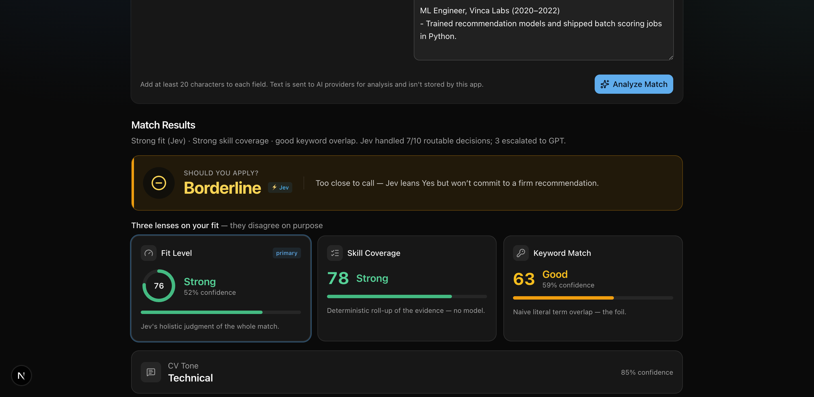
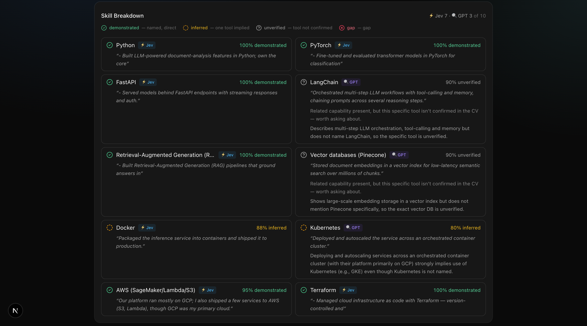
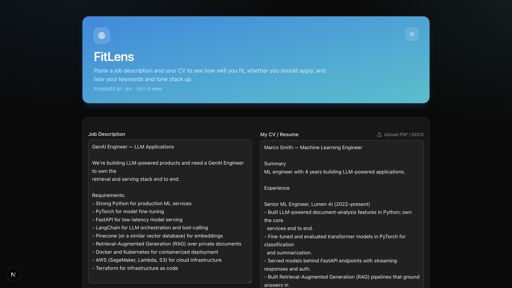

# FitLens

*Three lenses on your fit — a CV-to-job matching tool that returns **calibrated, typed decisions** instead of free-form text — powered by [Jev](https://www.typesafe.ai/), a System-One decision model, running through the [Vercel AI Gateway](https://vercel.com/docs/ai-gateway).*

Paste a job description and your CV (or upload a PDF), and the app scores your fit, classifies **how well the CV evidences each required skill**, and — crucially — tells you **how confident it is** in every judgment, abstaining when a call is genuinely too close.

> **Why this exists:** most "AI resume checkers" wrap an LLM that outputs prose you can't measure. This project is an experiment in the opposite direction: a fast decision model that returns probabilities you *can* measure, calibrate, and benchmark. The [evaluation layer](#evaluation) is the point.



---

## What it does

For a given job description + CV, it returns:

| Output | What it means |
|---|---|
| **Fit Level** | Jev's holistic match (Strong / Moderate / Weak) as a 0–100 score + confidence |
| **Should Apply** | A **three-state** recommendation — **Yes / Borderline / No** — with an abstention band so it says "Borderline" instead of faking a confident coin-flip |
| **Skill Match** | A **deterministic** 0–100 score aggregated from the per-skill evidence statuses — a transparent, no-model baseline that sits alongside Jev's holistic take |
| **Keyword Match** | Naive keyword overlap — deliberately included as a *foil* to show how little literal term-matching actually tells you |
| **CV Tone** | Professional / Technical / Generic |
| **Skill Breakdown** | Per required skill: a **4-state evidence status** + confidence %, and the exact CV sentence that justifies it |

The skill list is **not hardcoded** — it's extracted from whatever job you paste, so the breakdown adapts to every role.

### Three lenses on the same CV, on purpose

The app shows **Keyword Match**, **Skill Match**, and **Fit Level** side by side because they *disagree*, and the disagreement is the insight:

- **Keyword Match** — dumb string overlap. A CV that parrots the job's vocabulary scores high here even with no real evidence.
- **Skill Match** — a deterministic roll-up of the evidence statuses (no model, fully auditable).
- **Fit Level / Should Apply** — Jev's holistic judgment.

When these three diverge, you're looking at exactly the cases keyword-matchers get wrong.

### The 4-state evidence model

Binary "has it / doesn't" throws away the most interesting cases. Every required skill is classified as one of:

| Status | Meaning | Example |
|---|---|---|
| **demonstrated** | Named, direct experience | *"…fine-tuned models in **PyTorch**…"* |
| **inferred** | The specific tool is unambiguously implied though not named | *"packaged into **containers**"* ⇒ Docker |
| **unverified** | Only a general capability is present; the CV doesn't pin down the specific tool | *"stored embeddings in a **vector index**"* — Pinecone? pgvector? FAISS? |
| **missing** | No evidence, or an explicit gap | *"I haven't worked with AWS"* |

The distinction between **inferred** and **unverified** is the crux — it's the difference between "one dominant tool fits this sentence" and "several plausible tools fit." (See [`eval/rubric.md`](eval/rubric.md).)



---

## How it works

A pipeline that mirrors the System-One / System-Two split, with a **confidence router** in the middle:

```
Job Description + CV
        │
        ▼
┌───────────────────────────────────┐
│ STAGE 1 — LLM (generative)        │  "Read the job, list its required skills"
│ openai/gpt-5-mini                 │  → [Python, PyTorch, LangChain, Docker, …]
└───────────────────────────────────┘
        │  each skill becomes a typed 4-way CHOICE question
        ▼
┌───────────────────────────────────┐
│ STAGE 2 — Jev (decision)          │  ONE batched call answers everything:
│ typesafe-ai/jev                   │  fit_level · should_apply · keyword_match ·
│                                   │  cv_tone · a 4-state status per skill,
│                                   │  each with a calibrated probability
└───────────────────────────────────┘
        │
        ▼
┌───────────────────────────────────┐
│ CONFIDENCE ROUTER                 │  For each skill: is Jev's top choice shaky?
│                                   │  (top prob < 0.8 OR top-two margin < 0.15)
│                                   │        │ uncertain skills only
│                                   │        ▼
│                          ┌─────────────────────────────────┐
│                          │ gpt-5-mini re-classifies them   │
│                          │ → status + confidence + the     │
│                          │   exact CV sentence, in 1 call   │
│                          └─────────────────────────────────┘
└───────────────────────────────────┘
        │  confident Jev skills lacking a literal quote → 1 GPT backfill call for evidence
        ▼
┌───────────────────────────────────┐
│ Normalization layer               │  raw probabilities → stable app schema;
│ (app/api/analyze/route.ts)        │  deterministic Skill Match; 3-state apply band
└───────────────────────────────────┘
        │
        ▼
     Result card
```

**Jev is the decision-maker; the LLM parses text and covers Jev's uncertainty.** Jev classifies every skill in one fast batched call; only the skills it's *unsure* about (top probability below 0.8, or a narrow margin to the runner-up) are escalated to gpt-5-mini — which returns its own status, confidence, and a grounded evidence quote. Confident-but-unquoted skills get a cheap evidence-only backfill (Jev keeps ownership of the status). Every escalated skill is badged in the UI, so you can see exactly where the fast model deferred.

> **Score vs. confidence are distinct.** A fit *score* of 55 means "middling match." A *confidence* of 83% means "Jev is quite sure it's a Moderate match." Two different numbers measuring two different things — kept separate everywhere, on purpose, because it matters for calibration analysis.

> **Why "Borderline" exists.** `Should Apply` has a calibrated abstention band: apply-probability ≥ 0.60 → **Yes**, ≤ 0.40 → **No**, and anything in between → **Borderline**. A system that says "too close to call" when it genuinely is beats one that flip-flops between confident Yes and confident No on identical input.

---

## Evaluation

The interesting claim this project makes — *"this skill is `unverified`"* — is **checkable**. `unverified` isn't a guess about the candidate's true skill (unknowable from a CV); it's a claim about the **text**: does the CV pin down the specific tool? A second human reading the same CV can agree or disagree, which makes it a text-classification task with a ground truth.

[`eval/`](eval/) is an offline harness that scores the pipeline's per-skill status against human gold labels — **no dependencies, no API calls**, just `node eval/score.ts`:

- **Accuracy, macro-F1, per-class precision/recall/F1**
- **Confusion matrix** — where `inferred` and `unverified` get swapped
- **Quadratic-weighted κ + ordinal MAE** — agreement that penalizes big ordinal jumps
- **Expected Calibration Error** — is "85% confident" right ~85% of the time?
- **Router slice** — do the GPT-escalated skills actually beat Jev on accuracy? (Does escalation earn its cost?)

The current seed set is small — treat the numbers as illustrative, not significant. The methodology is the point; see [`eval/README.md`](eval/README.md).

---

## Tech stack

- **Next.js 16** (App Router) + **React 19** + **TypeScript**
- **Vercel AI SDK 7** — `experimental_evaluate` (Jev) and `generateObject` (LLM), via the AI Gateway
- **Tailwind CSS** + **shadcn/ui**
- **Zod** for schema validation
- **unpdf** + **mammoth** for PDF / DOCX text extraction
- **pnpm**

---

## Running it locally

### Prerequisites
- Node.js 20+ for the app (the eval scorer uses native TS type-stripping — Node **22+**)
- [pnpm](https://pnpm.io/installation) (`npm install -g pnpm`)
- A **Vercel AI Gateway API key** — see below

### 1. Clone and install
```bash
git clone https://github.com/jaysanghavi55/fitlens.git
cd fitlens
pnpm install
```

### 2. Add your API key
The app calls Jev and gpt-5-mini through the Vercel AI Gateway, so you need your own key:

1. Go to the [Vercel Dashboard](https://vercel.com/dashboard) → **AI Gateway** → **API Keys** → create a key.
   *(A credit or debit card must be on file to unlock the free credits; set a small daily spend limit to stay safe.)*
2. Copy the template and paste your key:
   ```bash
   cp .env.example .env.local
   ```
3. Open `.env.local` and set:
   ```
   AI_GATEWAY_API_KEY=your_actual_key_here
   ```
   `.env.local` is gitignored — your key stays local and is never committed.

### 3. Run
```bash
pnpm dev
```
Open http://localhost:3000, paste a job description and CV (or upload a PDF/DOCX), and hit **Analyze Match**.



### Run the eval
```bash
node eval/score.ts        # scores eval/results/ against eval/gold.jsonl — no deps, no API calls
```

---

## A note on determinism

Every score is the output of a model call (Jev + up to three gpt-5-mini calls), and models are stochastic — the same input can drift a point or two between runs. Unambiguous judgments (a named skill → `demonstrated` at 100%) are rock-solid; only **boundary cases** flicker — a fit score near the Strong/Moderate cutoff, or a skill on the `inferred`/`unverified` line. That's not noise to hide, it's signal: it's precisely why the abstention band and calibration analysis exist.

---

## Roadmap

The working demo is done. The research layer is where this becomes a real evaluation of a decision model — some of it now shipped:

- [x] **4-state evidence model** — `demonstrated / inferred / unverified / missing`, not binary has-it/doesn't
- [x] **Confidence-based routing** — Jev handles what it's sure of; uncertain skills escalate to an LLM. Thresholds are explicit hypotheses, tuned against eval evidence.
- [x] **Abstention band** — `Should Apply` returns Borderline in the coin-flip zone instead of forcing Yes/No.
- [x] **Evaluation harness** — offline scorer with confusion matrix, per-class F1, weighted κ, ECE, and a router slice.
- [ ] **Larger labeled dataset** — 200+ cases across an edge-case taxonomy (explicit / synonym / transferable / negation / ambiguous).
- [ ] **Second annotator + inter-annotator agreement** (Cohen's κ) on the `inferred`/`unverified` boundary.
- [ ] **Baselines** — TF-IDF, sentence-embedding similarity, and an LLM judge, to measure what Jev actually buys you.
- [ ] **Risk–coverage curve** for the router — how much can be decided autonomously at each confidence threshold.

---

## Project status

**v1** — working demo: two-stage pipeline with a confidence router, 4-state evidence model, three-lens scoring, calibrated abstention, dynamic skill breakdown, PDF/DOCX upload, model-agnostic normalization layer, and an offline eval harness. Research phase in progress.

## License

MIT
