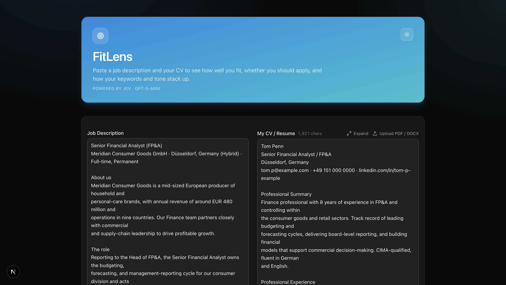
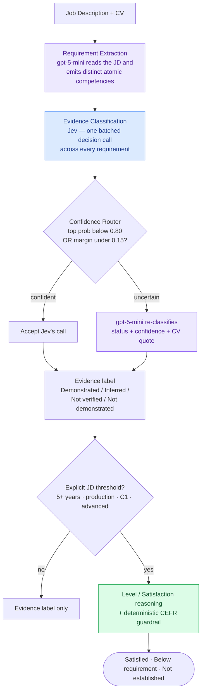
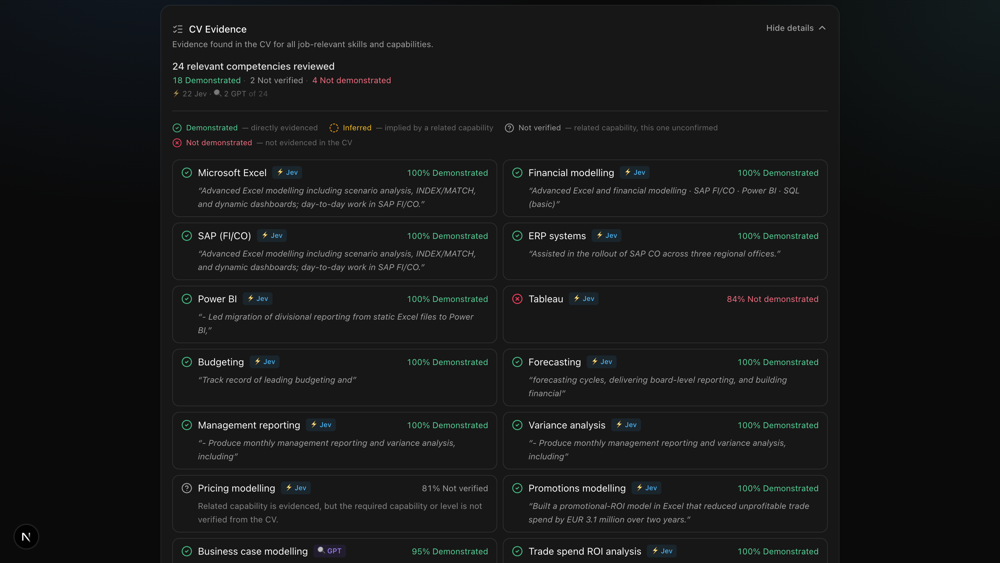
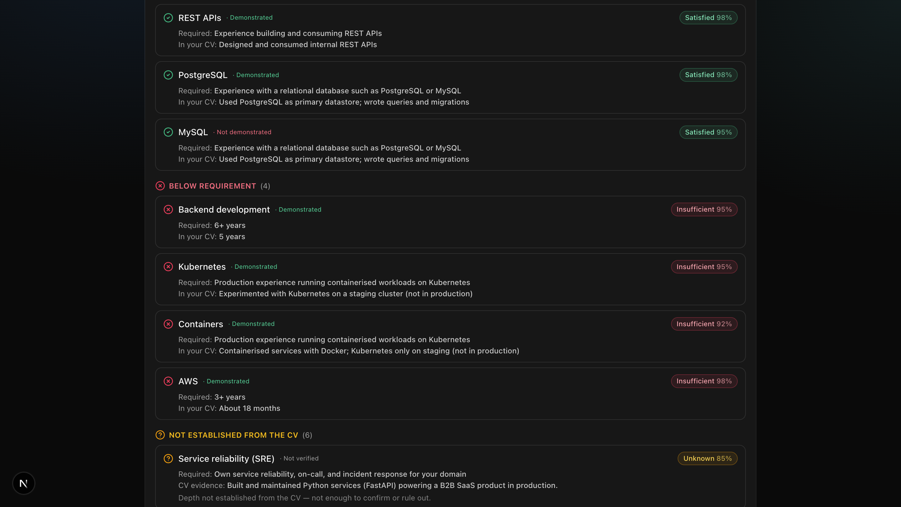
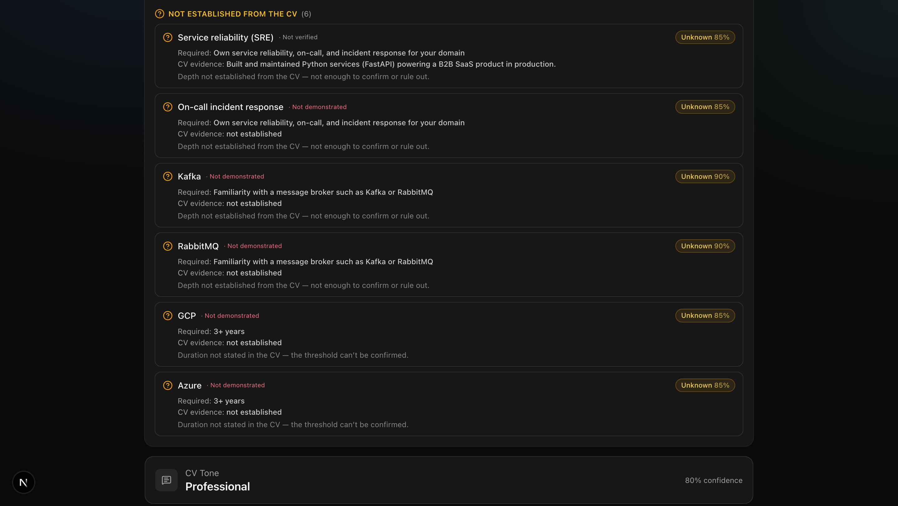
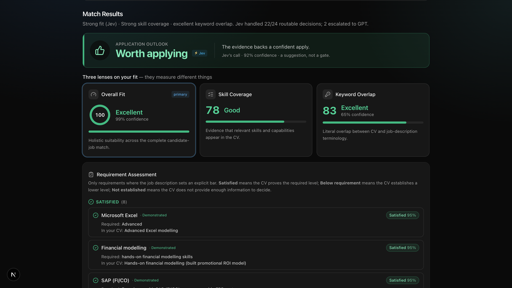
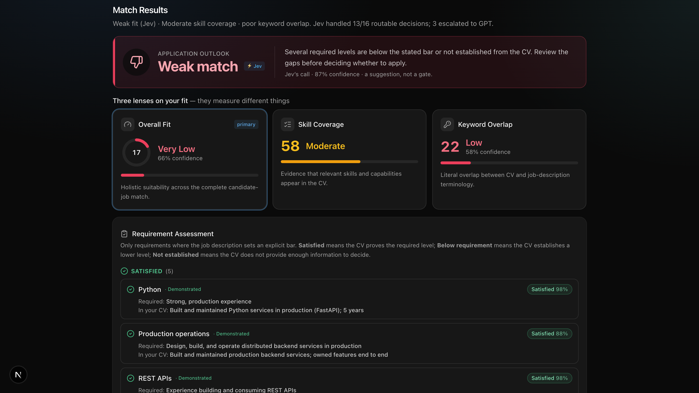

# FitLens

*Evidence-grounded CV-to-job matching with hybrid AI routing, requirement-level reasoning, and held-out evaluation.*

FitLens is an experimental GenAI decision-support system that compares a candidate CV with a job description. Instead of asking only *"does this CV mention the right skills?"*, it separates two fundamentally different questions:

1. **Is there evidence** that the candidate has this competency?
2. **Does that evidence satisfy the level** this job actually requires?

That distinction is the central design principle of the project — and the reason FitLens is built as a measurable experiment rather than another prose-generating "AI resume checker."

> **Why the split matters.** A CV that says *"completed a Spark bootcamp capstone; have not used Spark in production"* against a job requiring *"production Apache Spark experience"* should not collapse to `Spark → Match`. FitLens reports both facts: **Evidence: Demonstrated** and **Requirement satisfaction: Below requirement**. Both are simultaneously correct.



---

## Architecture

A pipeline that mirrors a System-One / System-Two split, with a confidence router in the middle and a deterministic layer around the model where the domain allows it.



<details>
<summary>Same pipeline as plain text</summary>

```
                Job Description + CV
                         │
                         ▼
              Requirement Extraction         gpt-5-mini reads the JD,
              (atomic requirements)          emits distinct competencies
                         │
                         ▼
              Evidence Classification         Jev — one batched decision
                    (Jev)                     call across every requirement
                         │
                  Confidence Router           top prob < 0.80 OR
                  ┌──────┴──────┐             top-two margin < 0.15 → escalate
              confident      uncertain
                  │              │
                accept        gpt-5-mini re-classifies
                  │              (status + confidence + CV quote)
                  └──────┬───────┘
                         ▼
              Evidence: Demonstrated / Inferred / Not verified / Not demonstrated
                         │
                         ▼
              Explicit JD threshold?          "5+ years", "production",
                  ┌──────┴──────┐             "C1", "advanced"…
                  no            yes
                  │              │
                finish           ▼
                         Level / Satisfaction reasoning
                         (+ deterministic CEFR guardrail)
                                 │
                    Satisfied · Below requirement · Not established
```

</details>

**Jev owns first-pass evidence classification. `gpt-5-mini` handles requirement extraction, ambiguous evidence cases escalated by the confidence router, and explicit level/satisfaction reasoning.** Only skills Jev is *unsure* about (winning-class probability below `0.80`, or a top-two probability margin under `0.15`) escalate to `gpt-5-mini`. Confident-but-unquoted skills get a cheap evidence-only backfill; Jev keeps ownership of the status. Every escalated skill is badged in the UI, so you can see exactly where the fast model deferred.

---

## Core design principles

**1. Evidence is not qualification.** *"The candidate has this skill"* and *"the candidate meets this job's bar for it"* are different claims. A competency can be `Evidence: Demonstrated` **and** `Requirement: Below requirement` without contradiction.

**2. Unknown is not insufficient.** If a job wants *5+ years Kubernetes* and the CV says *"experienced Kubernetes engineer"*, the CV neither establishes five years **nor** proves fewer. FitLens returns `Satisfaction: Unknown`. Absence of evidence that a threshold is met is not evidence that it is unmet.

**3. Requirements are atomic.** Fusing *"ServiceNow ITOM / Discovery & CMDB"* into one competency produces false positives — strong CMDB evidence should not imply strong Discovery. Distinct competencies that can independently be present or absent are kept separate and independently auditable.

**4. Use cheap classification where possible.** A cost-aware cascade (Jev first, GPT only on ambiguity) instead of routing every decision through the larger model. Router thresholds were chosen from an offline risk-coverage sweep, not intuition, then frozen before held-out testing.

**5. Ground decisions in literal text.** A skill does not become `Demonstrated` because a *related* technology appears. JD `SNMP` + CV *"troubleshot MID Server connectivity"* → `Not verified`. Semantic similarity is not treated as evidence.

---

## Evidence classification

Every required competency is classified into one of four evidence states. These answer only **what evidence exists in the CV** — not whether it meets the job's level.

| Status | Meaning |
|---|---|
| **Demonstrated** | The CV directly supports the competency |
| **Inferred** | The competency is strongly implied but not directly stated |
| **Not verified** | Related evidence exists, but the specific capability can't be established |
| **Not demonstrated** | The required competency is not supported by the CV |

The distinction between **Inferred** and **Not verified** is the crux — the difference between "one dominant tool fits this sentence" and "several plausible tools fit." (See [`eval/rubric.md`](eval/rubric.md).)



## Requirement assessment

When the JD specifies an explicit threshold — *6+ years Python*, *production Kafka*, *German C1*, *advanced SQL* — FitLens adds a second assessment on top of the evidence label:

- **Satisfied** — the CV positively establishes a level meeting the threshold.
- **Below requirement** — the CV positively establishes a level below the threshold.
- **Not established** — the CV has insufficient information to determine whether the threshold is met.

*Implementation note:* internally the satisfaction states are `satisfied`, `insufficient`, and `unknown`; the UI presents these as **Satisfied**, **Below requirement**, and **Not established** respectively.

Requirements without an explicit threshold (*Python*, *Salesforce*, *HL7*) get an evidence label only — FitLens does not invent a bar the JD never stated.





### Worked example: one skill, two questions

```
JD:   Production experience running Apache Spark workloads
CV:   Completed a data-engineering bootcamp capstone using
      Apache Spark; have not run Spark in production.

Evidence:                Apache Spark → Demonstrated      (the candidate really has used Spark)
Requirement satisfaction: Production   → Below requirement (bootcamp, explicitly not production)
```

### CEFR language reasoning — a guardrail, not a guess

Language requirements exposed a classic GenAI failure mode: an LLM will happily read *"Spanish – fluent"* as `≈ C1`, even though the CV establishes no CEFR level. FitLens uses **deterministic** CEFR comparison over the fixed ordering `A1 < A2 < B1 < B2 < C1 < C2`, and only compares when both sides carry an explicit CEFR token:

```
German   required C1, CV C1        → Satisfied
French   required C1, CV B1        → Below requirement
Spanish  required C1, CV "fluent"  → Not established   (Evidence: Demonstrated stands; the C1 requirement is simply unproven)
```

During held-out testing the satisfaction model once returned `"fluent" → satisfied`. FitLens preserves the raw model decision for evaluation, while the deterministic CEFR layer overrides the unsupported comparison to `Unknown`. **Use LLMs where semantic reasoning helps; prefer deterministic validation when the domain has explicit, machine-verifiable rules.**

### Robust output identity — not every failure is a model failure

A requirement can enter the model as `Go` and come back as `Golang` or `Go (Golang)`; a fragile string join would silently drop an otherwise-correct answer. The satisfaction layer was hardened so that **ID determines identity, name is metadata**: matching prioritizes stable IDs, then a conservative normalized-name / alias fallback, and unmatched results are made observable instead of silently discarded. Joins, schemas, and observability matter as much as model reasoning.

---

## Three independent fit lenses

FitLens deliberately does **not** collapse everything into one number. The interface shows three lenses that answer different questions and are *expected* to disagree:

- **Overall Fit** — Jev's holistic candidate-job suitability.
- **Skill Coverage** — how much relevant competency evidence appears in the CV.
- **Keyword Overlap** — literal terminology overlap between CV and JD.

```
Overall Fit       53   Moderate
Skill Coverage    96   Excellent
Keyword Overlap   67   Good
```

Excellent skill coverage does **not** mean every explicit requirement is satisfied — which is exactly why the Requirement Assessment panel exists alongside the scores. Satisfaction is a **separate decision-support lens**; it is intentionally *not* wired into Overall Fit, Skill Coverage, or the Application Outlook (see [Scope](#scope)).





---

## Evaluation

The interesting claim FitLens makes — *"this skill is Not verified"* — is **checkable**: it's a claim about the text, not about the candidate's true ability, so a second reader can agree or disagree. [`eval/`](eval/) is an offline harness (no API calls, no dependencies) that scores per-skill status against human gold labels.

### Methodology

The project follows a pre-registration discipline to avoid fitting to the eval set:

```
hypothesis → author cases → write human gold labels BEFORE model output
→ freeze the pre-registration → capture model responses → freeze outputs
→ score → classify disagreements → identify coherent failure modes → only then change the system
```

It deliberately avoids the *run → see failure → tweak prompt → rerun same example → report improved accuracy* loop.

### Results

```
Development set (influenced development — optimistic):
  153 requirement pairs · 96.1% exact-status accuracy · QWK 0.968 · MAE 0.052 · ECE 1.2%

Held-out Phase 2 (unseen, deliberately diverse):
  103 requirement pairs · 86.4% exact-status accuracy · QWK 0.875 · MAE 0.204 · ECE 8.5%
```

The **lower held-out number was more informative than the higher dev number.** It exposed a coherent failure mode: the system modeled the *presence* of evidence well, but did not reliably model whether that evidence was *sufficient for the required level* — which directly motivated the Level / Satisfaction layer.

**Router slice:** escalation earns its cost. On the uncertain slice, accepting Jev's shaky answers scored 51.9%; escalating them to `gpt-5-mini` scored 81.5% (**8 fixed, 0 broken**). Thresholds (`0.80` / `0.15`) were the best-performing observed setting on the eval set, then frozen. Full per-row disagreement analysis lives in [`eval/BASELINE.md`](eval/BASELINE.md) and [`eval/PREREG.md`](eval/PREREG.md).

### Synthetic-data disclosure

The evaluation corpus is **synthetic**, hand-constructed to probe specific matching behaviors and edge cases. The metrics are **not** a claim of production recruiting accuracy on a representative population.

> A defensible statement: *FitLens achieved 86.4% exact evidence-status accuracy on a held-out synthetic benchmark of 103 requirement pairs across multiple domains and edge cases.* Production validation would require substantially larger, independently labeled real-world data plus fairness, reliability, and calibration studies.

---

## What failed (and what it taught)

1. **Requirement conflation** — grouped competencies (`ITOM / Discovery / CMDB`) inflated coverage → *atomic extraction*.
2. **Evidence confused with proficiency** — coursework/POC correctly *demonstrated* a tool while failing a *production* requirement → *separate Evidence from Level/Satisfaction*.
3. **CEFR semantic overreach** — `"fluent" ≈ C1` → *deterministic CEFR comparison*.
4. **Subjective thresholds** — *strong / advanced / expert / deep / extensive* are far less objective than *5+ years / C1 / production*, and held-out testing showed more uncertainty there. Subjective satisfaction judgments stay **report-only** and never auto-drive a rejection.
5. **Activity-semantic alignment** — similar-looking experience isn't always equivalent: *"3+ years deploying applications to Kubernetes"* does not necessarily establish *"3+ years operating Kubernetes infrastructure in production."* FitLens can still struggle when the duration matches numerically but the underlying activity differs.
6. **Model nondeterminism** — extraction/naming drift, mitigated with atomic extraction, stable IDs, alias handling, frozen eval artifacts, and regression tests.
7. **Alternative requirements (A or B)** — atomic extraction can surface alternatives such as *"Power BI or Tableau"* or *"ACCA / CIMA / CPA / CFA"* as separate competencies. A candidate may satisfy the actual requirement through one alternative while the others still read as *Not demonstrated* in CV Evidence, which can make Skill Coverage look lower than the candidate's practical fit. Alternative-group semantics are not currently modeled explicitly.

---

## Scope

**Supported:** JD requirement extraction · atomic competency decomposition · CV evidence classification · Jev-first hybrid routing with GPT escalation · certifications & languages · explicit threshold detection · duration / CEFR / experience-depth comparisons · Satisfied / Below requirement / Not established outcomes · deterministic CEFR guardrails · evidence grounding · raw-model-vs-guarded-system evaluation · PDF/DOCX ingestion · requirement-level UI explanations · collapsible CV evidence.

**Intentionally out of scope:** Satisfaction does **not** automatically modify Overall Fit, Skill Coverage, or Application Outlook. That layer stays a separate lens until validation is strong enough to justify folding it into scoring. FitLens is built to **support human judgment, not automate hiring decisions.**

---

## Tech stack

- **Next.js 16.3.3** (App Router) · **React 19** · **TypeScript 5.7.3**
- **Vercel AI SDK 7** (`ai@7`) — Jev via `experimental_evaluate`, `gpt-5-mini` via `generateObject`, both through the [Vercel AI Gateway](https://vercel.com/docs/ai-gateway)
- Models: **`typesafe-ai/jev`** (decision) · **`openai/gpt-5-mini`** (extraction / escalation)
- **Tailwind CSS 4** + **shadcn/ui** (`@base-ui/react`)
- **Zod 4** for schema validation; deterministic guardrails in `lib/cefr.ts`
- **unpdf** + **mammoth** for PDF / DOCX extraction
- **pnpm** · offline TypeScript eval harness (frozen JSONL gold sets, regression assertions, calibration analysis)

## Repository structure

```
FitLens/
├── app/
│   └── api/
│       ├── analyze/route.ts      # main pipeline: extract → Jev → router → assembly
│       └── extract/route.ts      # PDF / DOCX text extraction
├── components/
│   ├── match-analyzer.tsx        # input + orchestration (client)
│   ├── result-card.tsx           # result surface (server component — no eval telemetry leaks)
│   └── collapsible-card.tsx      # progressive-disclosure wrapper (client)
├── lib/
│   ├── cefr.ts                   # deterministic CEFR comparator
│   └── types.ts
├── eval/
│   ├── cases/                                # JD + CV fixtures
│   ├── results/  results-phase3/             # frozen model outputs (do not overwrite)
│   ├── BASELINE.md  PREREG.md  PHASE3.md  PHASE3-GEN.md  COVERAGE.md
│   ├── gold.jsonl  gold-phase2.jsonl  gold-satisfaction.jsonl
│   ├── score.ts  score-satisfaction.ts  sweep.ts  expect.ts  capture.ts  cefr.test.ts
│   └── rubric.md
└── README.md
```

## Running locally

**Prerequisites:** Node.js **20+** for the app (the eval scorer uses native TypeScript type-stripping — Node **22+**), [pnpm](https://pnpm.io/installation), and a **Vercel AI Gateway API key** (one key powers both models).

```bash
# 1. Clone and install
git clone https://github.com/jaysanghavi55/fitlens.git
cd fitlens
pnpm install

# 2. Add your API key
cp .env.example .env.local
#    then set AI_GATEWAY_API_KEY=your_actual_key   (.env.local is gitignored)

# 3. Run
pnpm dev            # http://localhost:3000

# Production build
pnpm build && pnpm start
```

Get a key at the [Vercel Dashboard](https://vercel.com/dashboard) → **AI Gateway** → **API Keys** (a card must be on file to unlock free credits; set a small daily spend limit).

### Running the eval (offline — no API, no cost)

```bash
node eval/score.ts                                 # dev set   → gold.jsonl
node eval/score.ts gold-phase2.jsonl               # held-out  → Phase 2 benchmark
node eval/score-satisfaction.ts gold-satisfaction.jsonl   # requirement satisfaction
node eval/sweep.ts                                 # router threshold risk-coverage sweep
node eval/expect.ts                                # range-based regression assertions (non-zero exit on failure)
node eval/cefr.test.ts                             # deterministic CEFR unit tests
```

`eval/capture.ts` re-runs the **live** pipeline and spends gateway budget — run it only intentionally, and never over the frozen `results/` or `results-phase3/` namespaces.

---

## Key lessons

1. **Model output is not evaluation** — a plausible response is not evidence the system generalizes.
2. **Evidence is not qualification** — demonstrating a technology ≠ meeting the required level.
3. **Unknown is valuable** — a trustworthy system abstains when the source doesn't establish an answer.
4. **Not everything should be an LLM** — closed, deterministic domains (CEFR) belong to explicit guardrails.
5. **GenAI failures are often software failures** — identity joins, schemas, serialization, and UI semantics matter as much as model reasoning.
6. **Held-out failures beat high benchmark scores** — the most important improvements came from experiments where performance *dropped*.

## Status — portfolio release

- [x] Atomic requirement extraction
- [x] Evidence classifier + Jev → GPT confidence routing
- [x] Held-out evidence evaluation
- [x] Level / Satisfaction reasoning with abstention (Unknown)
- [x] Deterministic CEFR guardrail + robust satisfaction identity joins
- [x] Requirement Assessment UI + collapsible CV Evidence view
- [x] PDF / DOCX ingestion · production build
- [x] README · portfolio screenshots
- [x] Architecture diagram
- [ ] Final release tag · GitHub publication

## Disclaimer

FitLens is an experimental, educational project. It is **not** intended to make autonomous hiring decisions, rank individuals for employment, or replace human evaluation. CVs omit relevant experience, job descriptions contain ambiguous requirements, and language-model outputs can be wrong. Treat FitLens as an explainable decision-support tool, not a hiring authority.


---

<sub>**Suggested GitHub description:** Evidence-grounded CV/job matching with hybrid LLM routing, explicit requirement satisfaction, abstention, deterministic guardrails, and held-out evaluation.</sub>
<sub>**Topics:** `generative-ai` `llm` `machine-learning` `llm-evaluation` `responsible-ai` `typescript` `nextjs` `model-routing` `ai-engineering` `evaluation`</sub>
